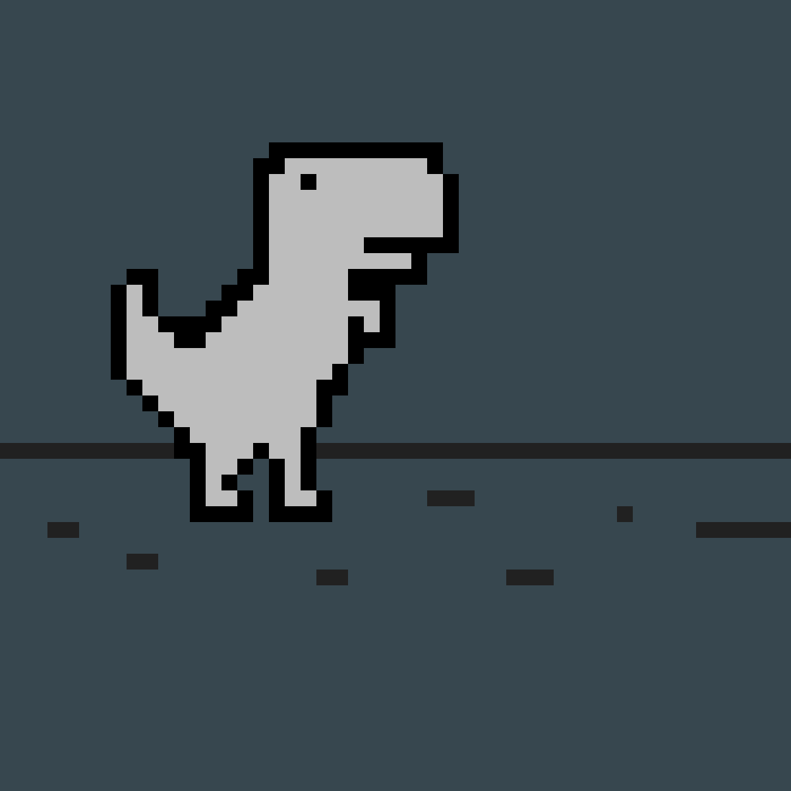

# 🦖 Square Dino Game

A pixel-art endless runner game inspired by Chrome's Dino game, with enhanced features including boss battles, power-ups, and dynamic backgrounds!



## ✨ Features

### 🎮 Core Gameplay
- **Endless Running**: Dodge obstacles and collect items
- **Boss Battle**: Fight against a powerful UFO boss
- **Dynamic Background**: Dark ancient forest transforms into colorful world after defeating the boss

### 🌟 Power-ups & Items
- 🚀 **Rocket**: Fly freely through the sky
- 🧲 **Magnet**: Automatically collect nearby items
- ⏳ **Slow Motion**: Slow down obstacles
- ✈️ **Glide**: Extended air time
- 🪖 **Tank Mode**: Fire bullets and destroy obstacles
- 🛡️ **Shield**: Protection from damage

### 👤 User System
- **Account Creation & Login**: Save your progress
- **Play History**: Track your distance and boss defeats
- **30/4 Item**: Special collectible unlocked by defeating the boss

### 🎨 Visual Effects
- Atmospheric lighting with golden rays
- Volumetric fog and particle effects
- Fireworks celebration on achievements
- Smooth parallax scrolling backgrounds
- Dynamic weather effects

## 🎯 Controls

| Key | Action |
|-----|--------|
| `Space` / `↑` | Jump |
| `↓` | Crouch/Duck |
| `P` / `Enter` | Pause/Resume |
| `F` | Fire bullet (during boss battle) |

## 🎭 Game Modes

1. **Normal Mode**: Endless running with increasing difficulty
2. **Boss Battle Mode**: Triggered after reaching certain distance
3. **Post-Boss Mode**: Colorful world with enhanced visuals

## 🖼️ Screenshots

The game features:
- 🌲 Dark ancient forest atmosphere before boss battle
- 🌈 Vibrant colorful world after defeating the boss
- 🎆 Epic firework effects for achievements
- 🌟 Smooth animations and pixel-art graphics

## 🚀 Getting Started

1. Clone this repository:
   ```bash
   git clone https://github.com/YOUR_USERNAME/square-dino-game.git
   ```

2. Open `index.html` in your browser

3. Create an account and start playing!

## 🛠️ Technologies Used

- Pure HTML5 Canvas
- Vanilla JavaScript (No frameworks!)
- CSS3 for UI styling
- LocalStorage for data persistence

## 📝 Credits

- Developed with passion ❤️
- Pixel art assets and sound effects
- Inspired by Chrome Dino Game

## 📄 License

This project is open source and available for educational purposes.

---

**Enjoy the game! 🎮✨**
